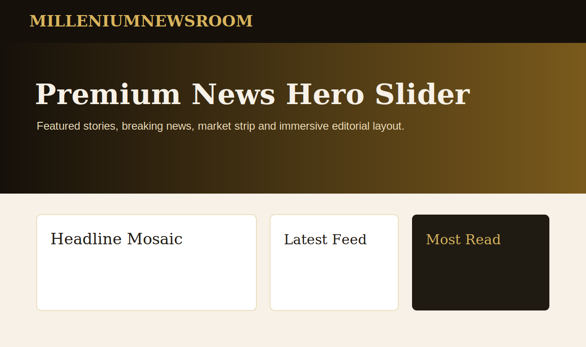
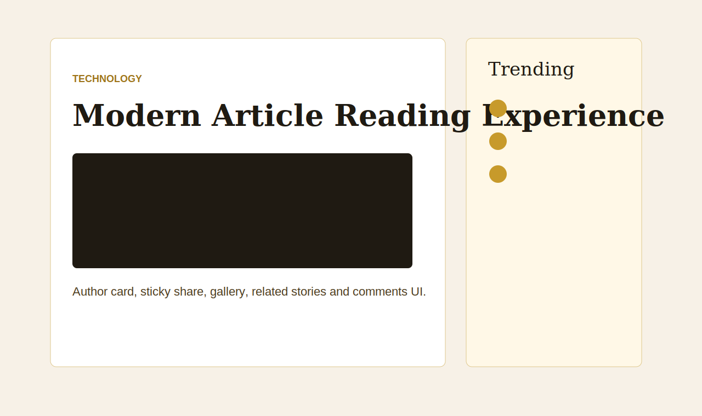
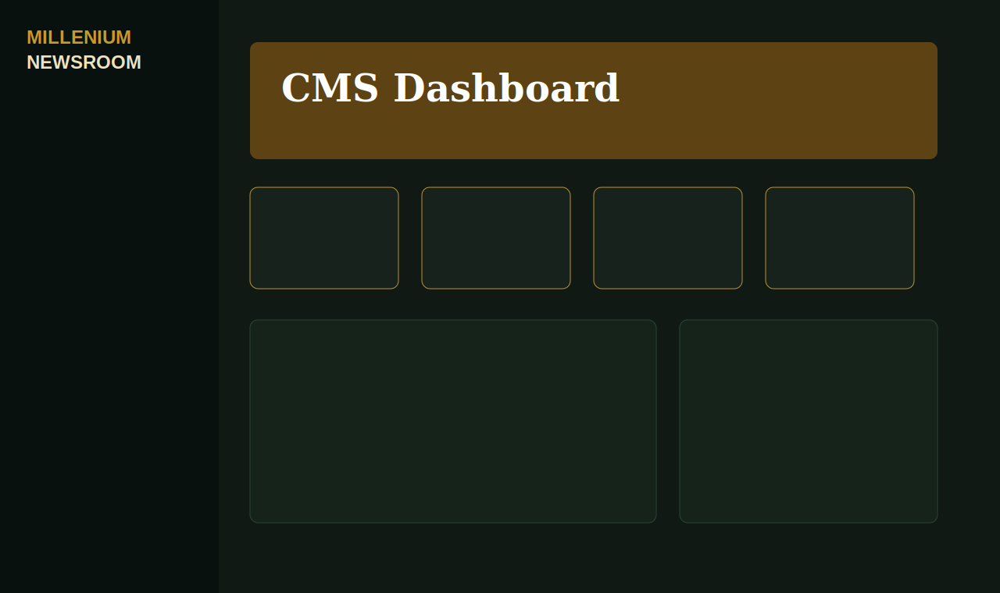
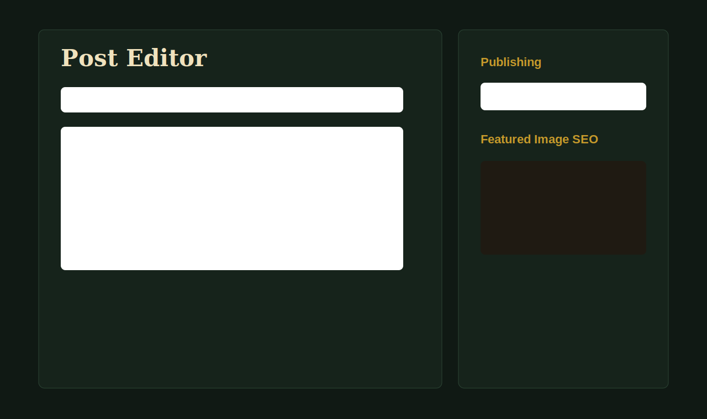

# MILLENIUMNEWSROOM

MILLENIUMNEWSROOM is a Laravel-based premium news portal and CMS. It includes a modern public news frontend, dynamic article publishing, media management, SEO tooling, ad placement management, and an admin panel for editorial teams.

## Features

- Premium responsive news homepage with hero slider, headline mosaic, trending blocks, editor picks, latest news, category highlights, newsletter, and ad slots.
- Dynamic post CMS with categories, subcategories, authors, tags, featured images, galleries, scheduling, breaking/featured/trending flags, and reading time.
- TinyMCE editor with image upload support.
- Media library with image previews, filename display, alt text, folder support, and secure image validation.
- SEO tools: meta title, meta description, meta keywords, canonical URL, robots meta, Open Graph, Twitter cards, article schema, XML sitemap, news sitemap, robots.txt, and visual HTML sitemap.
- Admin modules for posts, categories, authors, pages, homepage sections, navigation, footer, redirects, branding, media, and ad placements.
- Google AdSense/HTML ad placement management for header, sidebar, in-content, and footer ads.
- Frontend and admin dark mode support.
- Demo content seeders for categories, author, homepage sections, ads, pages, and sample posts.

## Tech Stack

- Laravel 12
- PHP 8.2+
- Blade templates
- Eloquent ORM
- SQLite for local development by default
- TinyMCE editor
- Plain CSS, no Tailwind dependency

## Screenshots






## Local Installation

```bash
git clone https://github.com/YOUR_USERNAME/milleniumnewsroom.git
cd milleniumnewsroom
composer install
cp .env.example .env
php artisan key:generate
```

For local SQLite:

```bash
type nul > database/milleniumnewsroom.sqlite
php artisan migrate --seed
php artisan storage:link
php artisan serve --host=127.0.0.1 --port=8000
```

For Linux/macOS SQLite:

```bash
touch database/milleniumnewsroom.sqlite
php artisan migrate --seed
php artisan storage:link
php artisan serve
```

Open:

- Frontend: `http://127.0.0.1:8000`
- Admin: `http://127.0.0.1:8000/admin/login`

## Demo Admin Login

Seeded admin account:

```text
Email: Sumitkant7@gmail.com
Password: configured in the database seeder for the project owner
```

For production, rotate the password after first login and do not publish live credentials in public documentation.

## Environment Setup

Copy `.env.example` to `.env`, then update:

- `APP_URL`
- `APP_ENV`
- `APP_DEBUG=false` in production
- Database credentials
- Mail credentials
- Queue/cache/session drivers

For MySQL production, use:

```env
DB_CONNECTION=mysql
DB_HOST=127.0.0.1
DB_PORT=3306
DB_DATABASE=milleniumnewsroom
DB_USERNAME=your_database_user
DB_PASSWORD=your_secure_password
```

## Database

Run migrations and demo seed data:

```bash
php artisan migrate --seed
```

Fresh local reset:

```bash
php artisan migrate:fresh --seed
```

Seeders create:

- Admin user
- Categories
- Author
- Sample posts
- Homepage sections
- Pages
- SEO settings
- Ad placements
- Footer settings

## Storage And Uploads

Uploaded images are stored on the `public` disk and served through Laravel's storage symlink.

```bash
php artisan storage:link
```

Make sure these directories are writable on hosting:

```text
storage
bootstrap/cache
```

## Useful Routes

- `/` homepage
- `/blog` latest posts
- `/blog/{slug}` article page
- `/category/{slug}` category page
- `/search` search page
- `/sitemap` visual HTML sitemap
- `/sitemap.xml` XML sitemap
- `/news-sitemap.xml` Google News sitemap
- `/robots.txt` robots rules
- `/admin/login` admin login

## Production Deployment

On a VPS or hosting server:

```bash
git clone https://github.com/YOUR_USERNAME/milleniumnewsroom.git
cd milleniumnewsroom
composer install --no-dev --optimize-autoloader
cp .env.example .env
php artisan key:generate
php artisan migrate --force
php artisan storage:link
php artisan config:cache
php artisan route:cache
php artisan view:cache
php artisan event:cache
```

Set the web root to:

```text
public/
```

Recommended production `.env` values:

```env
APP_ENV=production
APP_DEBUG=false
CACHE_STORE=database
SESSION_DRIVER=database
QUEUE_CONNECTION=database
LOG_CHANNEL=stack
```

## GitHub Workflow

Initialize and push to GitHub:

```bash
git init
git add .
git commit -m "Prepare MILLENIUMNEWSROOM for production"
git branch -M main
git remote add origin https://github.com/YOUR_USERNAME/milleniumnewsroom.git
git push -u origin main
```

For team development:

```bash
git checkout -b feature/your-feature
git add .
git commit -m "Describe your change"
git push -u origin feature/your-feature
```

## Security Checklist

- Never commit `.env`.
- Run `APP_DEBUG=false` in production.
- Change demo admin password.
- Use HTTPS in production.
- Keep `vendor/`, `node_modules/`, cache files, logs, and uploaded runtime files out of Git.
- Keep upload validation restricted to safe image MIME types.
- Review any ad code before enabling it.
- Keep Laravel and Composer dependencies updated.

## Testing

```bash
php artisan test
```

Recommended pre-deployment checks:

```bash
php artisan migrate --pretend
php artisan route:list --except-vendor
php artisan config:clear
php artisan cache:clear
php artisan view:clear
```

## Performance Notes

- CSS is lightweight and framework-free.
- Images use lazy loading where possible.
- Sitemaps and meta tags are generated dynamically.
- Use Laravel cache commands in production.
- Serve assets through a CDN when traffic grows.

## License

This project is prepared for the MILLENIUMNEWSROOM website. Add your preferred license before publishing publicly.
